# 🗄️ PantiJanda — Struktur Database

Aplikasi **PantiJanda** (*Pahlawan Sejati, Jawara Andalan*) menggunakan database relasional **PostgreSQL 14+**.

| File | Isi |
|---|---|
| `schema.sql` | Skema lengkap: 17 tipe ENUM, 23 tabel, 3 view, index & foreign keys |
| `seed.sql` | Data awal (mengikuti demo di `src/data/seed.js`) + konfigurasi settings |

> **Catatan:** `widow_profiles.kpi_points` adalah kolom *cache* untuk tampilan; angka kanonik dihitung dari `SUM(points)` pada `kpi_logs` — sehingga seed KPI tidak perlu persis sama dengan poin profil demo.

## Cara menjalankan

```bash
createdb pantijanda
psql -d pantijanda -f database/schema.sql
psql -d pantijanda -f database/seed.sql
```

## Diagram Relasi (ERD ringkas)

```mermaid
erDiagram
    users ||--o| widow_profiles : "profil janda (privat)"
    users ||--o{ bank_accounts : "data bank"
    users ||--o{ experiences : "teknis & non-teknis"
    users ||--o{ documents : "upload file"
    users ||--o{ follows : "follow/follower"
    users ||--o{ kpi_logs : "riwayat kontribusi"
    users ||--o{ subscriptions : "langganan tier"
    users ||--o{ contracts : "kontrak/MOU"
    users ||--o{ marketplace_products : "lapak"
    users ||--o{ chat_groups : "leader grup"
    widow_profiles ||--o| documents : "dokumen validasi janda"
    users ||--o{ businesses : "usaha & modal"
    businesses ||--o{ rab_items : "RAB"
    businesses ||--o{ commitments : "dukungan non-janda"
    users ||--o{ events : "penyelenggara"
    events ||--o{ event_registrations : "tiket QR + absen"
    chat_groups ||--o{ chat_group_members : "anggota"
    chat_groups ||--o{ chat_messages : "pesan"
    courses ||--o{ course_enrollments : "akademi"
    users ||--o{ course_enrollments : ""
    users ||--o{ ai_mentor_sessions : "AI mentor/tools"
    users ||--o{ donations : "donatur / penerima"
    donations ||--o| subscriptions : "pembayaran langganan"
```



## Daftar Tabel & Fungsi Bisnisnya

### 1. Akun & Pendaftaran
| Tabel | Kolom kunci | Menjelaskan fitur |
|---|---|---|
| `users` | `username`, `email`, `password_hash`, `role(admin/user)`, `is_widow`, `accepted_tnc` | Form daftar hanya username/email/password → popup **Syarat & Ketentuan** (`accepted_tnc`) → pertanyaan **status janda** (`is_widow`) menentukan Member Janda vs Sahabat (non-janda). Password disimpan sebagai hash bcrypt. |
| `settings` | `key`, `value JSONB` | Dashboard admin: fee admin, min donasi, min harga tiket, level minimum pembuat event, metode pembayaran, aturan KPI, ambang level, harga tier. |

### 2. Profil Member Janda (privat — disembunyikan di halaman depan)
| Tabel | Kolom kunci |
|---|---|
| `widow_profiles` | tempat & tanggal lahir, alamat domisili, nomor WhatsApp, asuransi & jenisnya, minat/hobi, **talents (bakat → dibaca AI Akademi)**, `level` (wonder-woman/sosialita/the-ceo/high-society), `kpi_points`, `validation_doc_id` (dokumen validasi status janda), `is_verified` |
| `bank_accounts` | nama bank, no. rekening, atas nama (untuk pencairan donasi) |
| `experiences` | `category` **teknis/non-teknis** × `type` pelatihan/workshop/seminar/even/kemampuan-lain |
| `documents` | semua upload: validasi-janda, foto-profil, proposal, RAB, kontrak, MOU, bukti-bayar |

### 3. Usaha, RAB & Dukungan
| Tabel | Kolom kunci |
|---|---|
| `businesses` | jenis usaha, `capital_needed` (kebutuhan modal), `proposal_text` — dibuka via tombol frame view |
| `rab_items` | item, qty, unit_price → view `v_business_rab_total` menghitung total otomatis |
| `commitments` | user **non-janda** memberi dukungan komitmen ke usaha member janda |

### 4. Sosial
| Tabel | Kolom kunci |
|---|---|
| `follows` | setiap user bisa saling follow (PK komposit, cek anti self-follow) |
| `chat_groups` + `chat_group_members` + `chat_messages` | grup chat per level status sama; `member_role='leader'` (ketua) memicu poin KPI |

### 5. Event, Tiket & Absensi (QR)
| Tabel | Kolom kunci |
|---|---|
| `events` | `form_fields JSONB` = pengaturan form pendaftaran yang muncul di menu Event halaman depan; `allow_non_widow`; dibuat hanya oleh admin/member berlevel ≥ `min_event_create_level` |
| `event_registrations` | `ticket_code` UNIQUE = payload **QR tiket masuk**; `checked_in_at` diisi saat **scan QR untuk absen** |

### 6. Level, KPI & Langganan
| Tabel | Kolom kunci |
|---|---|
| `kpi_logs` | sumber poin: grup-leader(40), buat-event(50), bantu-member(25), promosi-nonjanda(15), akademi(30), lapak(10), kontrak(60) — jumlah poin menentukan kenaikan level wonder-woman→sosialita(150)→the-ceo(400)→high-society(800) |
| `subscriptions` | langganan bulanan Bronze/Silver/Gold; badge tier aktif seketika tanpa syarat level selama `status='aktif'` & belum `expires_at` |

### 7. Donasi & Pembayaran
| Tabel | Kolom kunci |
|---|---|
| `donations` | `donor_user_id NULL` = donatur tak terdaftar (anonim); `method` payment-gateway/qris/virtual-account/e-wallet/transfer-manual; `proof_doc_id` = upload **bukti bayar** (diverifikasi admin via `verified_by/verified_at`); view `v_donor_totals` → **badge grade donor** (Perak/Emas/Platinum/Diamond) |

### 8. Akademi & AI Tools
| Tabel | Kolom kunci |
|---|---|
| `courses` + `course_enrollments` | katalog pelatihan, progress %, `kpi_reward` |
| `ai_mentor_sessions` | percakapan AI per topik: `akademi` (mentor berbasis bakat), `proposal/rab/bisnis/kontrak/mou` (AI tools pembuat dokumen di dashboard) |

### 9. Kerja Sama & Marketplace
| Tabel | Kolom kunci |
|---|---|
| `contracts` | kontrak kerjasama/MOU/proposal + nilai + status → masuk laporan keuangan |
| `marketplace_products` | lapak janda: produk/jasa, kategori, harga, jumlah order |

### Views (Laporan)
- `v_business_rab_total` — total RAB tiap usaha.
- `v_donor_totals` — akumulasi donasi per donor (menentukan badge/grade).
- `v_finance_summary` — laporan keuangan: total donasi sukses, nilai kontrak, jumlah event, member janda, langganan aktif.

## Catatan Keamanan
- `password_hash` wajib bcrypt/argon2 — seed memakai placeholder.
- Kolom privat (`widow_profiles`, `bank_accounts`, `documents`) tidak boleh diekspos di API halaman depan; gunakan role/permission terpisah atau kolom SELECT khusus (contoh: publik hanya `username`, `full_name`, avatar, level, bio).
- `documents.file_url` sebaiknya mengarah ke storage privat bertanda tangan (S3 presigned URL).
